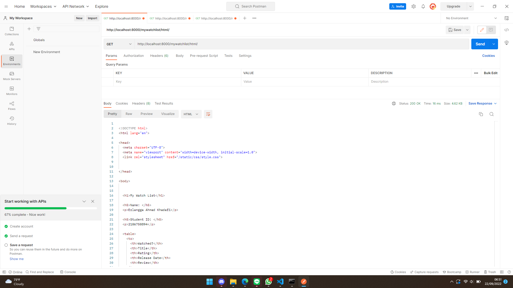
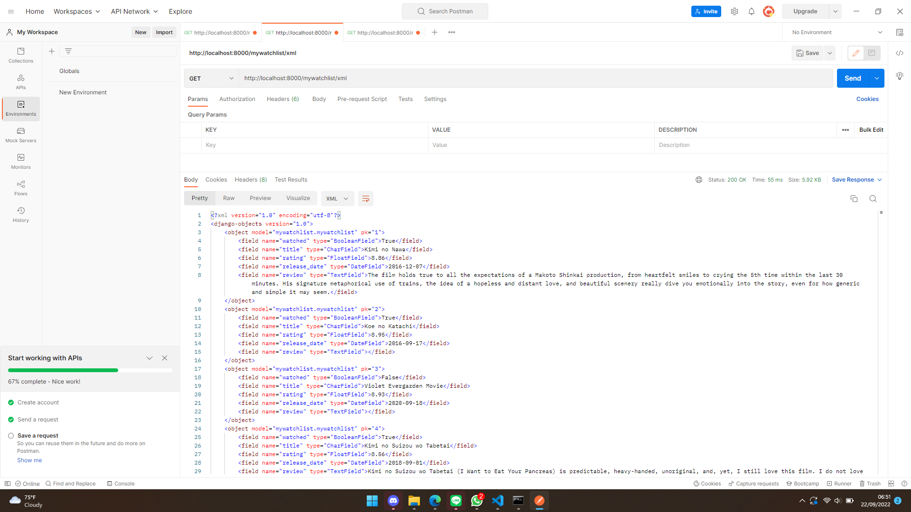
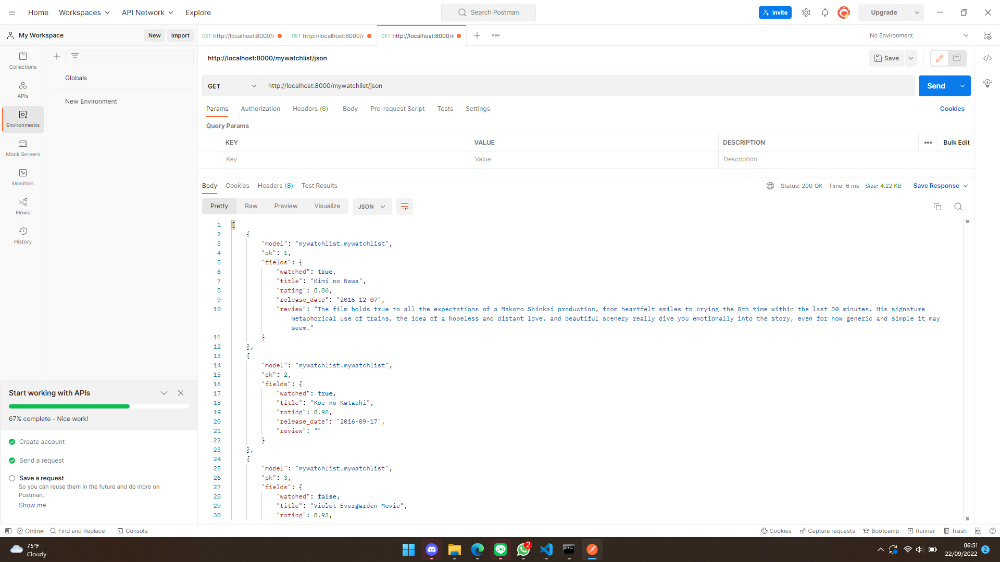

# Assignment 3 PBP

Nama  : Erlangga Ahmad Khadafi

NPM   : 2106750894

Kelas : PBP-B

## LINK

Main Page           : https://tugas2dafi.herokuapp.com/

Katalog Page        : https://tugas2dafi.herokuapp.com/katalog/

MyWatchlist Page    : https://tugas2dafi.herokuapp.com/mywatchlist/

## Perbedaan antara JSON, XML, dan HTML

### HTML
1. Digunakan untuk men-display suatu dokumen ke dalam web browser
2. Data yang ingin ditampilkan di-wrap oleh tag
3. Tag bersifat case insensitive
### XML
1. Digunakan untuk menyimpan dan melakukan pertukaran data
2. Data yang disimpan di-wrap oleh tag
3. Tag bersifat case sensitive
### JSON
1. Digunakan untuk menyimpan dan melakukan pertukaran data
2. Data disimpan dalam bentuk string
3. Lebih mudah untuk digunakan daripada XML dan lebih cepat daripada XML (ketika mengimplementasi AJAX)

## Data Delivery pada Platform
Data delivery diperlukan ketika kita ingin memindahkan data dari satu platform ke platform lainnya. Data tersebut dapat dikirimkan dalam berbagai format seperti HTML, XML, dan JSON. Data delivery memungkinkan terjadinya transfer data sehingga untuk aplikasi yang dikembangkan pada berbagai platform berbeda dapat mengakses data yang up-to-date pada setiap platformnya.

## Implementasi
1. Menjalankan virtual environment di project tugas 2 yang sudah pernah dibuat dengan perintah
`python -m venv env`
2. Menyalakan virtual environment dengan perintah `env\Scripts\activate.bat`
3. Membuat aplikasi mywatchlist dengan perintah `python manage.py startapp mywatchlist`
4. Menambahkan aplikasi mywatchlist ke dalam variabel INSTALLED_APPS untuk didaftarkan ke dalam proyek Django
5. Membuat class model pada models.py yang berisi attribute mengenai film
6. Melakukan makemigration dan migration untuk membuat skema model di database Django
7. Membuat file .json yang menjadi initial data yang berisi detail film yang akan ditampilkan
8. Melakukan load initial data dari file json ke database Django
9. Menambahkan method show_watchlist yang mereturn method render untuk menampilkan data dalam format html dan menambahkan method yang menampilkan data dalam bentuk json dan xml pada views.py dimana datanya berasal dari database Django
10. Menambahkan path menuju method pada views di urls.py sebagai routing agar nantinya client dapat mengakses halaman HTML, JSON, dan XML yang direturn oleh views.py
11. Menambahkan path /mywatchlist yang routing ke mywatchlist.urls pada urls.py di folder project_django agar link dapat diakses client
12. Membuat folder templates yang berisi mywatchlist.html sebagai template file HTML yang akan dirender oleh method di views.py
13. Membuat class Testing yang berisi method untuk test apakah sudah url sudah work
14. Menambahkan potongan kode `release: sh -c 'python manage.py migrate && python manage.py loaddata initial_mywatchlist_data.json'` ke Procfile
15. Add, commit, dan push ke repository github untuk dapat dideploy otomatis ke Django (karena sudah pernah membuat app tugas 2 di heroku)

## Postman
#### http://localhost:8000/mywatchlist/html
 
#### http://localhost:8000/mywatchlist/xml
 
#### http://localhost:8000/mywatchlist/json
 